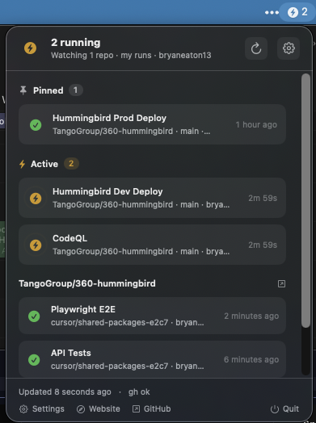

# RunBar

GitHub Actions, in your menu bar.

[](https://github.com/bryaneaton13/gh-actions-runbar#install)
[](LICENSE)
[](https://bryaneaton13.github.io/gh-actions-runbar/)

macOS 14+ menu bar app for the Actions runs you care about. Pick repositories, filter to your commits / PRs / manual runs, and pin workflows like Deploy to prod so they stay at the top. No Dock icon. Uses the GitHub CLI you already signed in.



## Why

The bar shows a live running count and turns red after a watched failure, including pinned deploys that failed hours ago. Pins ignore actor and event filters, so Deploy to prod does not disappear behind someone else's CI. "Only my runs" plus `push` / `pull_request` / `workflow_dispatch` / `merge_group` keep the list on your work.

## Install

Requires macOS 14+ (Sonoma), [GitHub CLI](https://cli.github.com/) (`gh`), and Swift 6 / Xcode Command Line Tools to build.

```bash
brew install gh
gh auth login
git clone https://github.com/bryaneaton13/gh-actions-runbar.git
cd gh-actions-runbar
make install
open ~/Applications/RunBar.app
```

RunBar is built on your Mac. There is no notarized download yet, so Gatekeeper is not in the way of a local `make install`.

## First run

1. Install and sign in with `gh` if you have not already.
2. Click the bolt in the menu bar.
3. Open **Settings** and add repositories (`owner/name` or **Browse GitHub repos**).
4. Optionally pin Deploy to prod (or any workflow) so its latest run always sits at the top.

## Privacy

RunBar reuses your existing `gh` session. It does not store a GitHub token or password. Settings live in `UserDefaults` and an owner-only file at `~/.config/runbar/config.json`. Click-through run links must be GitHub `https` URLs. See [Privacy](docs/privacy.md).

## Docs

- [Getting started](docs/getting-started.md)
- [Privacy](docs/privacy.md)
- [Architecture](docs/architecture.md)
- [Development](docs/development.md)
- [Releasing](docs/releasing.md)
- [Changelog](CHANGELOG.md)
- [Website](https://bryaneaton13.github.io/gh-actions-runbar/)

## Build from source

```bash
make build
make run
make test
make app      # dist/RunBar.app
make install  # ~/Applications/RunBar.app
```

## License

MIT · Bryan Eaton
